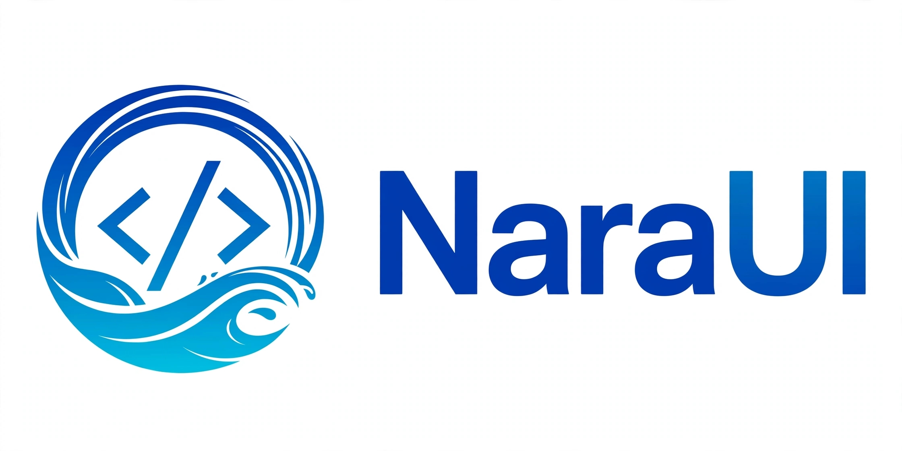

<div align="center">



# NaraUI

**Bahasa UI deklaratif yang mengompilasi menjadi SATU file HTML offline.**
Zero dependency · Zero build tool · Zero server · Jalan di browser mana pun, bahkan tanpa internet.

[](https://github.com/NarzX/NaraUI/actions/workflows/ci.yml)
[](https://github.com/NarzX/NaraUI/releases)
[](https://narzx.github.io/NaraUI/)
[](https://python.org)
[](LISENSI)

🎮 **[Coba Playground →](https://narzx.github.io/NaraUI/)** — compile `.nui` langsung di browser (Python asli via WebAssembly), tanpa install apa pun.

Dibuat dengan ❤️ oleh **NarzX** · [github.com/nezXproject](https://github.com/nezXproject)

</div>

---

## 📖 Daftar Isi

1. [Kenapa NaraUI?](#-kenapa-naraui)
2. [Quick Start](#-quick-start)
3. [Konsep Inti](#-konsep-inti)
4. [Referensi Tag](#-referensi-tag)
5. [Control Flow](#-control-flow)
6. [Komponen & Event](#-komponen--event)
7. [Routing & Transisi](#-routing--transisi)
8. [Styling: Dark Mode, Responsive, Animasi](#-styling-dark-mode-responsive-animasi)
9. [Gesture & Fitur Mobile](#-gesture--fitur-mobile)
10. [Aksesibilitas (A11y)](#-aksesibilitas-a11y)
11. [API Bawaan](#-api-bawaan)
12. [Referensi CLI](#-referensi-cli)
13. [Build Produksi: PWA & Web Component](#-build-produksi-pwa--web-component)
14. [Linter & Mode Strict](#-linter--mode-strict)
15. [Testing & CI](#-testing--ci)
16. [Playground](#-playground)
17. [Ekstensi VS Code](#-ekstensi-vs-code)
18. [Struktur Proyek](#-struktur-proyek)
19. [Changelog V1.0.0](#-changelog-v100)
20. [Limitasi & Roadmap](#-limitasi--roadmap)
21. [FAQ](#-faq)
22. [Kontribusi](#-kontribusi)
23. [Lisensi](#-lisensi)

---

## 🚀 Kenapa NaraUI?

Framework modern meminta banyak: Node.js, bundler, `node_modules` ratusan MB, server, CDN.
NaraUI mengambil jalan sebaliknya:

| | Framework biasa | **NaraUI** |
|---|---|---|
| Install | Node + bundler + deps | **Python stdlib saja** |
| Output | Bundle JS + CSS + asset | **1 file `.html`** |
| Runtime | Framework runtime ±100 KB+ | **±16 KB engine inline** |
| Offline | Butuh service worker manual | **Bawaan (`--pwa`)** |
| Distribusi | Hosting + deploy | **Kirim file-nya via WhatsApp pun jalan** |
| Belajar | JSX/TS/tooling | **Sintaks deklaratif 1 file** |

Cocok untuk: **aplikasi kasir/POS, kiosk, dashboard internal, form lapangan, tools offline, edukasi, prototype cepat** — dan berjalan mulus bahkan dari Termux di HP.

---

## ⚡ Quick Start

### 1. Ambil compiler

```bash
git clone https://github.com/NarzX/NaraUI.git
cd NaraUI
```

> Syarat: **Python 3.8+**. Tidak ada `pip install` apa pun — compiler hanya memakai standard library.

### 2. Tulis app pertama (`app.nui`)

```nui
App "Halo NaraUI" {
    @persist state: n = 0;

    Container {
        Text "Klik: {n}" { size: 32px; weight: bold; color: #0f172a | dark: white; }
        Button "+1" { background: #3b82f6; color: white; on-click: n += 1; }
    }
}
```

### 3. Compile & jalankan

```bash
python nara.py app.nui --watch
# 🚀 Berjalan di http://localhost:8080/app.html  (hot-reload aktif)
```

Atau tanpa server — buka langsung hasilnya:

```bash
python nara.py app.nui      # menghasilkan app.html
# double-click app.html → jalan. Selesai.
```

### 4. Atau mulai dari template

```bash
python nara.py --create pos       # kasir
python nara.py --create kiosk     # kiosk + form control
python nara.py --create admin     # dashboard + fetch API
python nara.py --create profil    # routing + transisi
python nara.py --create blank     # kosong
```

---

## 🧠 Konsep Inti

### State & reaktivitas

```nui
state: count = 0;              // reaktif: UI update otomatis saat berubah
@persist state: token = "";    // + tersimpan di LocalStorage (anti hilang saat refresh)
computed: double = count * 2;  // dihitung ulang otomatis saat dependensi berubah
```

State diakses langsung sebagai variabel di dalam ekspresi `{...}` dan action:

```nui
Text "Sisa: {10 - count}" {}
Button "Tambah" { on-click: count += 1; }
```

### `resource` — fetch API satu baris

```nui
resource: users = fetch("https://api.example.com/users");
```

Otomatis membuat tiga state: `users` (data), `users_loading` (bool), `users_error` (string). Pola pakai:

```nui
If "users_loading" { Text "Memuat..." { color: #94a3b8; } }
Else If "users_error" { Text "Gagal: {users_error}" { color: #ef4444; } }
Else {
    For "u in users" { key: u.id; Text "{u.name}" {} }
}
```

### `on-mount` — lifecycle hook

```nui
on-mount: {
    setInterval(() => { state.jam = new Date().toLocaleTimeString('id-ID'); }, 1000);
}
```

Kode di dalamnya berjalan dalam konteks `with(state)`, jadi assignment langsung menembus proxy reaktif.

---

## 🧱 Referensi Tag

### Layout

| Tag | Fungsi |
|---|---|
| `App "Judul" { }` | Root aplikasi (wajib, satu per file) |
| `Container` | Wrapper konten (max-width 1200px, padding responsif) |
| `Row` | Flexbox horizontal (`gap`, `justify-content`, `align-items`) |
| `Column` | Flexbox vertikal |
| `Card` | Panel dengan border, radius, padding |
| `ScrollBox` | Area scroll |
| *tag custom* (mis. `Box`) | `<div>` polos tanpa CSS bawaan — untuk widget pixel-perfect |

### Teks & media

| Tag | Contoh |
|---|---|
| `Text` | `Text "Halo {nama}" { size: 20px; weight: bold; }` |
| `Image` | `Image "{foto}" { width: 120px; radius: 50%; alt: "Foto profil"; }` |
| `Icon` | `Icon "fas fa-bell" { size: 24px; aria: "Notifikasi"; }` (Font Awesome) |

### Form (two-way binding via `bind`)

| Tag | Contoh |
|---|---|
| `Input` | `Input "Ketik nama..." { bind: nama; }` |
| `TextArea` | `TextArea "Catatan..." { bind: catatan; }` |
| `Select` + `Option` | `Select "Kota" { bind: kota; Option "Jakarta" {} Option "Bandung" {} }` |
| `Toggle` | `Toggle "Mode hemat" { bind: hemat; }` (switch, `role="switch"`) |
| `Checkbox` | `Checkbox "Setuju" { bind: setuju; }` |
| `Slider` | `Slider "Volume" { bind: vol; min: 0; max: 100; step: 1; }` |

Tipe binding otomatis: teks (`input`/`textarea`/`select`), boolean (`toggle`/`checkbox`), number (`slider`).

### Interaksi

| Tag | Contoh |
|---|---|
| `Button` | `Button "Simpan" { background: #10b981; color: white; on-click: simpan(); }` |

---

## 🔀 Control Flow

### If / Else If / Else

```nui
If "score >= 80"      { Text "A" { color: #10b981; } }
Else If "score >= 60" { Text "B" { color: #f59e0b; } }
Else                  { Text "C" { color: #ef4444; } }
```

Hanya **satu** cabang yang tampil (chain evaluation), aman untuk konten eksklusif.

### For + keyed diffing

```nui
For "item in products" {
    key: item.id;                 // opsional tapi disarankan untuk list besar
    Card {
        Text "{item.title}" { weight: bold; }
        Text "$ {item.price}" { color: #10b981; }
    }
}
```

- Dengan `key`: node DOM **didaur ulang** berbasis kunci — animasi tidak restart, fokus/input di dalam item bertahan, update list ribuan baris hanya menyentuh selisihnya.
- Tanpa `key`: fallback kunci = index (tetap diffing, bukan rebuild total).
- Variabel loop (`item`, `index`) tersedia di semua ekspresi dan action di dalam blok.

---

## 🧩 Komponen & Event

```nui
Component Dialog(title, pesan) {
    Card { background: #1e293b; width: 100%;
        Text "{title}" { color: white; weight: bold; }
        Text "{pesan}" { color: #94a3b8; }
        Button "Ya"  { background: #10b981; color: white; on-click: emit("confirm"); }
        Button "Batal" { background: transparent; color: white; on-click: emit("cancel"); }
    }
}

App "Demo" {
    Container {
        Dialog("Hapus data?", "Aksi ini permanen.") {
            on-confirm: toast("Terhapus! 💥");
            on-cancel:  toast("Dibatalkan");
        }
    }
}
```

Aturan argumen komponen:
- **Berkutip** = teks literal: `Dialog("Hapus?", ...)` → dirender apa adanya.
- **Tanpa kutip** = ekspresi: `CardProduk(item.title, item.price)` → dievaluasi reaktif.
- `Slot {}` = tempat anak komponen disuntik.
- `emit("nama")` di dalam komponen → ditangkap sebagai `on-nama:` di instance.

---

## 🗺 Routing & Transisi

```nui
Row {
    Button "Home"  { on-click: window.location.hash = '#/'; }
    Button "Profil" { on-click: window.location.hash = '#/profil'; }
}

Route "/" transition: fade { Text "Beranda" {} }
Route "/profil" transition: slide { Text "Profil saya" {} }
Route "/product/:id" transition: zoom {
    Text "Sedang melihat produk ID: {routeParams.id}" {}
}
```

- Routing berbasis hash → kompatibel dengan file offline (`file://`).
- Transisi: `slide`, `zoom`, `fade`.
- Parameter dinamis tersedia via `routeParams`.
- Fokus otomatis pindah ke route aktif (screen reader mengumumkan halaman baru).

---

## 🎨 Styling: Dark Mode, Responsive, Animasi

Semua prop adalah CSS langsung, plus alias nyaman (`size`→font-size, `weight`→font-weight, `radius`→border-radius).

### Dual-theme pipe

```nui
Text "Judul" { color: #0f172a | dark: white; }
```
Mengikuti preferensi OS **dan** bisa di-toggle manual via `toggleDark()`.

### Responsive pipe

```nui
Text "Judul" { size: 16px | md: 22px | lg: 28px; width: 100% | md: 50%; }
```
Breakpoint: `sm` 640px · `md` 768px · `lg` 1024px · `xl` 1280px.

### Hover & animasi

```nui
Card {
    hover-scale: 1.05;
    hover-shadow: 0 10px 25px rgba(0,0,0,0.25);
    hover-bg: #1e293b;
    animate: pop-out;        // fade-in | fade-in-up | pop-out
}
```

### Prop a11y & utilitas

```nui
Image "x.png" { alt: "Deskripsi untuk screen reader"; }
Icon "fas fa-x" { aria: "Tutup"; }        // tanpa aria → otomatis aria-hidden
Button "✕" { aria: "Tutup dialog"; tabindex: 0; role: button; }
Card { draggable: true; }                  // jendela bisa digeser (pointer/mouse/touch)
Button "Klik" { sound: "klik.mp3"; }       // bunyi saat diklik
Box { on-context-menu: toast("Klik kanan!"); }
```

---

## 📱 Gesture & Fitur Mobile

```nui
Card {
    on-swipe-left:  toast("Masuk keranjang via gesture!");
    on-swipe-right: window.location.hash = '#/cart';
}
```

- Swipe kiri/kanan terdeteksi pada elemen apa pun yang punya handler.
- Layout otomatis menyesuaikan layar < 768px (container full-width).
- Seluruh pipeline bisa dijalankan dari **Termux** — compiler dan hasilnya ramah HP.

---

## ♿ Aksesibilitas (A11y)

V1 memperlakukan a11y sebagai bawaan, bukan tambahan:

- `Image` tanpa `alt` → otomatis `alt=""` (dekoratif) + **warning linter**.
- `Icon` → otomatis `aria-hidden="true"` kecuali diberi `aria:`.
- `Button` → otomatis `type="button"`; `Toggle` → `role="switch"`.
- `Input/TextArea/Select/Slider` → `aria-label` otomatis dari teks param.
- Focus ring `:focus-visible` biru kontras pada semua kontrol.
- `prefers-reduced-motion` → semua animasi/transisi dimatikan otomatis.
- Toast = live region (`role="status"`, `aria-live="polite"`).
- Pergantian route memindahkan fokus ke halaman baru (`tabindex="-1"` + `.focus()`).

---

## 🧰 API Bawaan

Tersedia di semua ekspresi dan action:

| API | Fungsi |
|---|---|
| `toast("pesan")` | Notifikasi pop-up dari bawah |
| `toggleDark()` | Ganti tema gelap/terang |
| `NaraFS.write(nama, isi)` | Simpan file ke IndexedDB (async) |
| `NaraFS.read(nama)` | Baca file dari IndexedDB (async) |
| `state` | Akses objek state global dari JS bebas |
| `emit("event")` | Kirim event komponen |
| `routeParams` | Parameter route dinamis |

### DevTools bawaan

Buka app dengan `?nara-debug` di URL:

```
http://localhost:8080/app.html?nara-debug
```

Panel live menampilkan: jumlah render, ms per render, dan tree state real-time.

---

## ⌨️ Referensi CLI

```bash
python nara.py app.nui                      # compile sekali → app.html
python nara.py app.nui --watch              # dev server :8080 + hot reload
python nara.py app.nui --build              # build produksi (minified)
python nara.py app.nui --build --pwa        # + manifest + service worker (installable/offline)
python nara.py app.nui --build --embed      # + embed.js (Web Component <nara-app>)
python nara.py app.nui --strict             # compile; gagal jika ada lint warning
python nara.py --playground                 # playground lokal :8081
python nara.py --create pos|kiosk|admin|profil|blank
python nara.py --docs                       # generate DOCS.md dari compiler
python nara.py --vscode                     # generate ekstensi VS Code
```

---

## 📦 Build Produksi: PWA & Web Component

### PWA (offline & installable)

```bash
python nara.py app.nui --build --pwa
```
Menghasilkan: `app.html` (minified) + `manifest.webmanifest` + `sw.js` (cache-first) + `icon.svg`.
App bisa di-"Add to Home Screen" dan berjalan penuh tanpa internet.

### Embed ke proyek lain (React/Vue/HTML biasa)

```bash
python nara.py app.nui --build --embed
```
Lalu di halaman mana pun:

```html
<div id="nara-mount"></div>
<script src="embed.js"></script>
<!-- atau sebagai Web Component: -->
<nara-app></nara-app>
```

---

## 🧹 Linter & Mode Strict

Compiler memberi warning compile-time dengan nomor baris + saran koreksi:

```
⚠️  [LINT] app.nui:3: tag 'Buton' tidak dikenal (dianggap <div> biasa) — mungkin maksud 'Button'?
⚠️  [LINT] app.nui:3: prop 'colr' tidak dikenal — mungkin maksud 'color'?
⚠️  [LINT] app.nui:7: nilai animate 'fade-in-upp' tidak dikenal (pilihan: fade-in, fade-in-up, pop-out)
⚠️  [LINT] app.nui:9: breakpoint 'xd' tidak dikenal (pilihan: sm, md, lg, xl)
⚠️  [LINT] app.nui:12: bind ke state 'belum' yang tidak dideklarasikan
⚠️  [LINT] app.nui:15: a11y: Image tanpa prop alt — tambahkan alt: "deskripsi"
⚠️  [LINT] info: state 'menu' dideklarasikan tetapi tidak pernah dibaca
```

Pakai `--strict` di CI agar warning = kegagalan build.

Error sintaks tampil dengan code-frame:

```
❌ [NARAUI ERROR] app.nui:7:1
    Slider "Volume" bind: vol min: 0 max: 100;
    ^
    -> Sintaks tidak valid: Slider — props harus di dalam kurung kurawal, contoh: Slider "..." { bind: x; }
```

---

## 🧪 Testing & CI

```bash
python -m unittest discover -s tests -v     # 50+ unit test
python tests/test_compiler.py --update      # refresh golden files (sengaja, setelah review)
```

Lapisan pengaman:

- **Unit test** lexer/parser/generator/build/lint/a11y/keyed-for.
- **Golden files** — snapshot output compiler; perubahan tak sengaja langsung merah.
- **Regression canaries** — string penjaga untuk bug masa lalu (infinite loop, `hash change`, korupsi whitespace, dll).
- **`node --check`** — setiap blok JS hasil compile divalidasi sintaksnya (skip otomatis jika node tidak ada).
- **GitHub Actions** — compile smoke + `--strict` lint + full unittest pada setiap push/PR.

---

## 🎮 Playground

- **Publik**: [narzx.github.io/NaraUI](https://narzx.github.io/NaraUI/) — compiler Python **asli** berjalan di browser via WebAssembly (Pyodide), diambil live dari branch `main`. Fitur: live compile, preview phone-frame 📱/, chip lint real-time, status ms + KB, tombol **Download .html**, 5 contoh siap pakai, kode tersimpan di localStorage.
- **Lokal**: `python nara.py --playground` → editor + preview di `localhost:8081`.

---

## 🎨 Ekstensi VS Code

```bash
python nara.py --vscode
```
Menghasilkan folder `naraui-vscode/` berisi syntax highlighting (TextMate grammar) + snippets (`app`, `route`, `persist`). Install: copy ke `~/.vscode/extensions/` atau `code --install-extension`.

---

## 🗂 Struktur Proyek

```
NaraUI/
├── nara.py                  # compiler + engine + linter + CLI (satu file!)
├── docs/
│   ├── index.html           # playground publik (GitHub Pages)
│   ├── logo.jpg             # logo utama (kotak)
│   └── logo-wide.jpg        # logo lebar (hero)
├── tests/
│   ├── test_compiler.py     # unit + golden + canaries
│   ├── fixtures/            # basic.nui, features.nui
│   └── golden/              # snapshot output compiler
├── .github/workflows/ci.yml # CI: smoke + lint strict + unittest
├── LISENSI
└── README.md
```

---

## 📜 Changelog V1.0.0

Rilis stabil pertama. Sorotan:

- ⚡ **Engine reaktif** berbasis Proxy dengan change-detection (bebas infinite render loop).
- 🔁 **Keyed `For`** — diffing DOM berbasis kunci untuk list besar.
- 🔒 **Precompiled expressions** — ekspresi dikompilasi saat build; tanpa `eval` runtime (CSP-friendly), konstruksi dinamis ter-guard `try/catch`.
- 🧩 **Komponen**: argumen literal vs ekspresi, `Slot`, `emit`/`on-event`.
- 🌗 **Dual-theme pipe** & **responsive pipe** (`| dark:`, `| md:`, `| lg:`).
- 📱 **Gesture** swipe kiri/kanan, `draggable`, `sound`, `on-context-menu`.
- ♿ **A11y bawaan**: alt/aria otomatis, focus ring, reduced-motion, live-region toast, focus management route.
- 📦 **Build**: minify, PWA (manifest + service worker), embed Web Component.
- 🧹 **Linter compile-time** dengan saran koreksi + mode `--strict`.
- 📚 **`--docs`**, **`--create` templates**, **`--vscode`**, **`--playground`**.
- 🧪 **Suite test + golden + canaries + CI GitHub Actions**.
- 🐞 Perbaikan bersejarah: infinite render loop (v13), dump HTML wttr.in, typo `hash change`, korupsi whitespace engine, quote pada prop `alt`/`aria`, crash linter pada prop list, false-positive linter pada string literal.

---

## ⚠️ Limitasi & Roadmap

**Limitasi jujur saat ini:**
- Routing berbasis hash (tanpa history API/SSR → tidak untuk situs yang butuh SEO).
- Model komponen = substitusi template + event; bukan props reaktif dua arah antar komponen.
- List > ±5.000 baris tetap membayar biaya signature `JSON.stringify` per render.
- Ekspresi adalah JavaScript bebas (tidak ada type-checking; linter membantu sebagian).

**Roadmap:**
- `nara test` headless (browser automation).
- Registry komponen publik untuk `import`.
- Token tema & i18n bawaan.
- History-API routing opsional untuk deployment ber-server.

---

## ❓ FAQ

**Butuh Node.js?** Tidak. Compiler = Python stdlib; output = HTML murni.
**App-nya benar-benar offline?** Ya. Hasil compile mandiri; dengan `--pwa` bahkan installable.
**Aman untuk produksi?** Ekspresi di-precompile (tanpa eval liar), output memakai `innerText` untuk binding teks (XSS-safe), dilindungi 50+ test + CI + linter strict.
**Bisa dipakai di HP?** Bisa — seluruh toolchain berjalan di Termux; preview phone-frame tersedia di playground.
**Playground butuh internet?** Sekali untuk memuat Pyodide dari CDN; setelah itu compile terjadi lokal di browser-mu. Compiler lokal (`--playground`) sepenuhnya offline.
**Bagaimana cara upgrade compiler?** `git pull` — playground publik otomatis memakai `main` terbaru.

---

## 🤝 Kontribusi

1. Fork & buat branch fitur.
2. Pastikan `python -m unittest discover -s tests` hijau.
3. Jika mengubah output compiler secara sengaja: `python tests/test_compiler.py --update` dan commit golden-nya.
4. PR → CI akan menjalankan smoke + lint strict + full test.

Bug report & ide: buka Issue di repo ini.

---

## 📄 Lisensi

Lihat berkas [LISENSI](LISENSI).

---

<div align="center">

**NaraUI V1.0.0** — satu file, sejuta aplikasi.
<br>© 2026 NarzX · [github.com/nezXproject](https://github.com/nezXproject)

</div>
